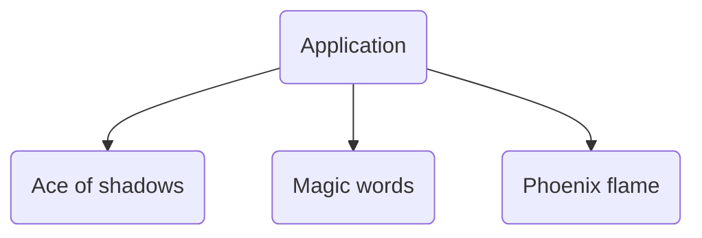

### Softgames test

Hello intrepid code-reviewer. I thought I would include some of my thoughts as I'm completing this test so you can get an insight into how I approach this sort of thing. My first thought is "this is actually fairly involved for a 24 hour coding test", so I'm assuming you're looking to see how handle that scenario. 

When looking through my code, you will note that I didn't include a third party library for tweening / animation. This is because I have written loads of little helper functions over the years for that kind of thing. The ones I've included here aren't the best but they are at least verbosely implemented so hopefully its easy to see the logic behind them.

> Observations

There seem to be a handful of `easter eggs` in the test that challenge common scenarios when working with pixi.js and client requirements.

- The spec said to use v7 of Pixi. I assume the intention was to get me to ask questions, which I normally would, but in the context of a coding assignment I opted to use a more modern version to keep things interesting.
- The conversation json has a number of _mistakes_, such as the missing avatar for neighbour, and the missing emoji.
- Attempting to load the images via the usual Assets mechanism didn't work on account of their API trying to serve up optimised assets that PIXI wasn't expecting. Again, I assume this was to see how I would handle these speedbumps. I opted to simply add in the missing data myself, but there are numerous other waysof handling this scenario.

> Composition

We will have a single pixi `Application` instance at the root inside `main.ts`, and each `scene` will be provided with a container that exists within that application context. This means we can switch between scenes, start / stop the update and render loops for each scene, without any kind of clunky bullshit.

> Design

I put in a fairly basic colour scheme and layout for the test scenes. I used a fairly whismical font to make it feel less serious.

> Implementation

The spec asked for 144 sprites so I thought i could demonstrate that I love building tools. I included a script that uses the npm `canvas` package to generate 144 Card sprites for the ace of shadows test.

> Issues

I've run out of time as I am juggling multiple projects at the moment so there are a number of things I haven't done that the spec asked for.

- I was going to use the new `ParticleContainer` but it seems that it is still unstable.
- Particle Emmitter would have been a good fallback but I decided to do a light touch implementation of my own, which isn't that brilliant.
- I'd like each scene to reset when the user revisits it. 
- The FPS isn't being rendered to the screen currently
- The app can be used in full screen but only if the users chooses too via browser.
- I put some thought into how it should respond to different browser sizes but that is one of the things that fell to the wayside given how little time I've had to dedicate to this.

> Summary

There are a few different ways I could / should have approached this but hopefully what I've made gives you an idea of how i do things. 