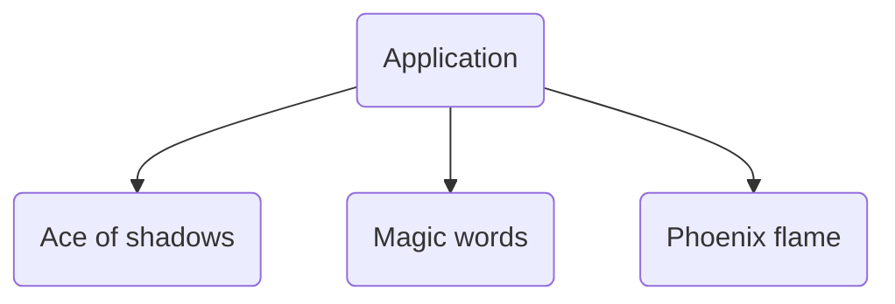

### Softgames test

Hello intrepid code-reiewer. I thought I would include some of my thoughts as I'm completing this test so you can get an insight into how I approach this sort of thing.

> Considerations

- [ ] Some kind of loading spinner would be a good shout.
- [ ] Optimise any image assets on deploy
- [ ] Konami code (?)

> Composition

We will have a single pixi `Application` instance at the root inside `main.ts`, and each `scene` will be provided with a container that exists within that application context. This means we can switch between scenes, start / stop the update and render loops for each scene, without any kind of clunky bullshit.

