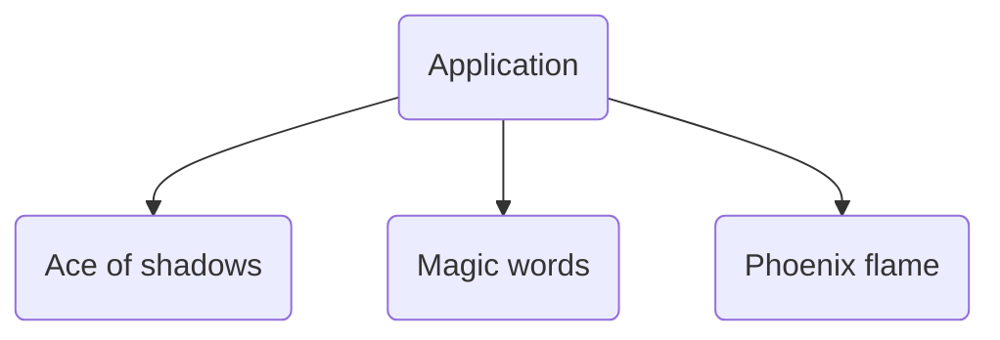

### Softgames test

Hello intrepid code-reiewer. I thought I would include some of my thoughts as I'm completing this test so you can get an insight into how I approach this sort of thing.

> Observations

There seem to be a handful of `easter eggs` in the test that challenge common challenges when working with pixi.js, and client requirements.

- The conversation json has a number of _mistakes_, such as the missing avatar for neighbour, and the missing emoji.
- Attempting to load the images via the usual Assets mechanism didn't work on account of their API trying to serve up optimised assets that PIXI wasn't expecting.

> Composition

We will have a single pixi `Application` instance at the root inside `main.ts`, and each `scene` will be provided with a container that exists within that application context. This means we can switch between scenes, start / stop the update and render loops for each scene, without any kind of clunky bullshit.

> Issues

I've run out of time so there are a lot of issues with this.

- I was going to use the new `ParticleContainer` but it seems that it is still unstable.
- Particle Emmitter would have been a good fallback but I decided to do a light touch implementation of my own, which isn't that brilliant.
- I'd like each scene to reset when the user revisits it. 